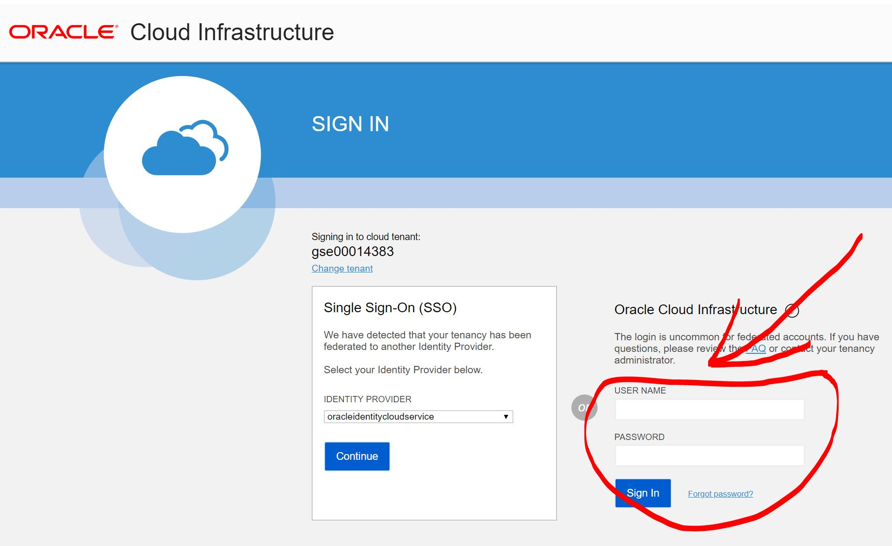

----

# Oracle Cloud Labs for JFokus 2019 #

## First login to your lab environment ##

Open a supported browser and go to the Console URL: [https://console.us-ashburn-1.oraclecloud.com](https://console.us-ashburn-1.oraclecloud.com)

Enter the tenant name: *gse00014383*

*NOTE:* Make sure you login using the username/password section on the right side of the login page.

Use the username and password you got from your instructor and login.

After logging in make sure the region on the top right say *eu-frankfurt-1*. If it does not please change it to do so.

Now you are ready to start with the labs!
_Please note that you do not have administrator rights in these lab environments. This mean that user and access management tasks can not be performed like they would for example in your own trial environment_

## These ziplabs are short and fast to complete ##

+ [Create a Virtual Cloud Network and a Virtual Machine Instance On Oracle Cloud Infrastructure Compute](https://github.com/oracle/learning-library/blob/master/ziplabs/oci-vm)
+ [Provisioning Autonomous Data Warehouse Cloud and Connecting with SQL Developer](https://github.com/oracle/learning-library/blob/master/ziplabs/adw-provisioning)
+ [Working with Database Services and Sample Data Sets](https://github.com/oracle/learning-library/tree/master/ziplabs/adw-services)
+ [Getting Started With Oracle Machine Learning Notebooks](https://github.com/oracle/learning-library/blob/master/ziplabs/adw-machine-learning)
+ [Provisioning Autonomous Transaction Processing and Connecting with SQL Developer](https://github.com/oracle/learning-library/blob/master/ziplabs/atp-provisioning)
+ [Working with Database Services and ATP Consumer Groups](https://github.com/oracle/learning-library/blob/master/ziplabs/atp-services)
+ [Scaling, Performance, and Monitoring in ATP](https://github.com/oracle/learning-library/blob/master/ziplabs/atp-scaling)

+ [Creating an Instance of Oracle MySQL Cloud Service](https://github.com/oracle/learning-library/blob/master/ziplabs/mysql-instance)
+ [Connect a Python Application to Oracle MySQL Cloud Service](https://github.com/oracle/learning-library/blob/master/ziplabs/python-mysql-accs)

----

## OCI Level 100 Hands-On Labs ##

Foundational labs for Oracle Cloud Infrastructure OCI.
These labs take between 5-20 minutes to complete.

+ [Virtual Cloud Network, 5 minutes](https://github.com/oracle/learning-library/blob/master/oci-library/L100-LAB/Virtual_Cloud_Network/VCN_HOL.md)
+ [Compute Service, 10 minutes](https://github.com/oracle/learning-library/blob/master/oci-library/L100-LAB/Compute_Services/Compute_HOL.md)
+ [Block Volume Service, 10 minutes](https://github.com/oracle/learning-library/blob/master/oci-library/L100-LAB/Block_Volume/Block_Volume_HOL.md)
+ [File Storage Service, 10 minutes](https://github.com/oracle/learning-library/blob/master/oci-library/L100-LAB/File_Storage_Service/FSS_HOL.md)
+ [Object Storage Service, 5 minutes](https://github.com/oracle/learning-library/blob/master/oci-library/L100-LAB/Object_Storage/ObjectStorage_HOL.md)
+ [Load Balancer Service, 15 minutes](https://github.com/oracle/learning-library/blob/master/oci-library/L100-LAB/Load_Balancer/load_balancer.md)
+ [Autonomous Data Warehouse, 20 minutes](https://github.com/oracle/learning-library/blob/master/oci-library/L100-LAB/Autonomous_Data_Warehouse/ADW_HOL.md)
+ [Audit Service, 5 minutes](https://github.com/oracle/learning-library/blob/master/oci-library/L100-LAB/Audit_Service/AUDIT_HOL.md)
+ [Reserved Public IP, 5 minutes](https://github.com/oracle/learning-library/blob/master/oci-library/L100-LAB/Using_Reserved_Public_IP/Reserved_Public_IP_HOL.md)
+ [Service Gateway, 5 minutes](https://github.com/oracle/learning-library/blob/master/oci-library/L100-LAB/Using_Service_GatewayUsing_Service_Gateway_HOL.md)

----

## OCI Level 200 Hands-On Labs ##

Next level of OCI labs. They take roughly 20 minutes each to complete.

+ [Service Gateway, 5 minutes](https://github.com/oracle/learning-library/blob/master/oci-library/L100-LAB/Using_Service_Gateway/Using_Service_Gateway_HOL.md)
+ [NAT Gateway, 20 minutes](https://github.com/oracle/learning-library/blob/master/oci-library/L200-LAB/NAT_Gateway/nat_gateway.md)
+ [VCN Local Peering Connection, 20 minutes](https://github.com/oracle/learning-library/blob/master/oci-library/L200-LAB/VCN_Local_Peering/vcn_local_peering.md)
+ [Compute Console Connection, 20 minutes](https://github.com/oracle/learning-library/blob/master/oci-library/L200-LAB/Compute-Console-Connection/HOL-Console-Connection.md)

----

## OCI DevOps Hands-On Labs ## 

DevOps labs on OCI. They take between 15-30 minutes to complete.

+ [Terraform and Container Engine for Kubernetes (OKE), 30 minutes](https://github.com/oracle/learning-library/blob/master/oci-library/DevOps/Terraform-and-OKE-LAB/tf_oke_hol.md)
+ [Oracle Cloud Infrastructure Registry, 15 minutes](https://github.com/oracle/learning-library/blob/master/oci-library/DevOps/Container_Registry/Container_Registry_HOL.md)
+ [Deploying Jenkins, 30 minutes](https://github.com/oracle/learning-library/blob/master/oci-library/DevOps/Deploying_Jenkins/Deploying_Jenkins_HOL.md)

----